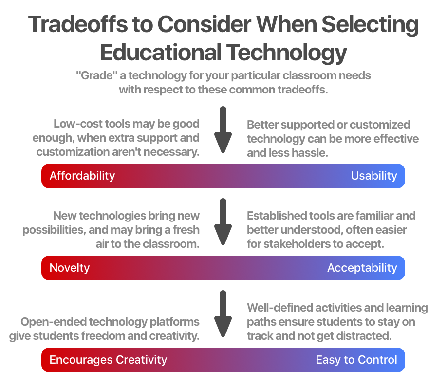

## Assignment 2.1: Your Method for Selecting Educational Technology

Develop a decision-making process that reflects your value and beliefs about the most important factors to consider when selecting educational technology AND you'll figure out how to communicate it graphically and concisely.

### My Submission

When creating this graphics, I focused on two aspects of selecting educational technology: Comparing the relative strengths of what’s available, and tailoring to the needs of a specific classroom or context. The decision-making “progress” is just a series of criteria that one can mentally “grade” on, but presented as pairs that are often tradeoffs against each other.

